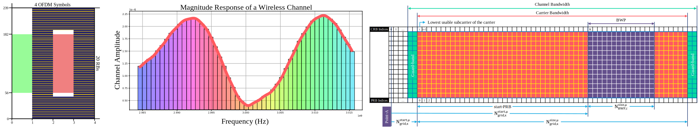

# Hardware-Emulations-using-5G-Toolkit-and-SDRs-Hands-on
This is an introductory course on 5G standards using software defined radios (SDRs). It aims to provide hand-on knowledge on 5G system design and 5G-NR 3GPP standards using [5G Toolkit](https://gigayasawireless.github.io/toolkit5G/) and software defined radios.
The course covers following Topics:

1. Spectrum analysis
2. Hardware impairments: Carrier frequency offset (CFO) estimation
3. Time and frequency synchronization
4. Initial Access using synchronization signal block (SSB)
5. Physical broadcast channel (PBCH)
6. Wireless channel estimation using DMRSs
7. M-QAM/QPSK symbol equalization and Decoding in 5G networks
8. Channel codes in 5G networks (LDPC and Polar codes)
9. Physical downlink control channel (PDCCH)
10. CORESET, blind decoding and search space
11. Physical downlink shared channel (PDSCH)
12. Multiple input multiple output (MIMO) systems in 5G Networks 

